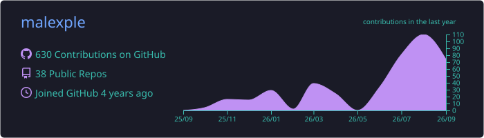
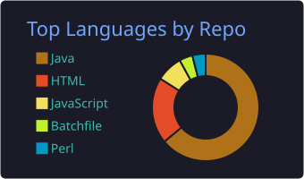
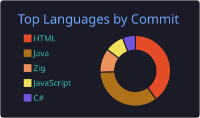
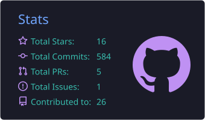
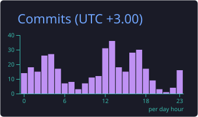

  

  <code><strong>MA</strong>king comp<strong>LEX</strong> sim<strong>PLE</strong></code>

  <em>Каждый проект здесь — это мостик между сложностью реального мира и удобством использования.</em>

---

## 🧭 Манифест

Я верю, что хорошая инженерия — это **упрощение**, а не усложнение. Поэтому мои проекты решают одну задачу: взять что-то запутанное (протокол, формат, систему, концепцию) и сделать это доступным через понятный интерфейс.

---

## 🚀 Работает в продакшене

Сервисы с реальными пользователями и живыми метриками — можно потрогать прямо сейчас.

<table>
<tr>
<td width="50%">

### 📚 Book Metadata Service

**[bookmetadata.ru](https://bookmetadata.ru)** — открытый каталог книжных метаданных.

- 📖 **1 776+ книг** и **1 388+ авторов** в базе
- 🔑 Бесплатный API без регистрации и ключей
- 🔀 Open Library + Google Books + FantLab → одна карточка

Попробовать: `curl "https://bookmetadata.ru/api/v1/search/isbn/9785389143852"`

</td>
<td width="50%">

### 🧠 Scanner Profile

**[Пройти тест](https://malexple-scanner-profile.hf.space/)** — тип по Барбаре Шер + гении по Ленсиони.

- 👥 **1 053 человека** начали, **255** прошли до конца
- 📈 Конверсия 24.2% · [публичная статистика](https://malexple-scanner-profile.hf.space/stats?lang=ru)
- 🌍 3 языка: RU / EN / 中文 · 🤗 Hugging Face Spaces

</td>
</tr>
</table>

Метрики сервисов — по состоянию на сентябрь 2026.

---

## 📚 Хаос метаданных → Чистый API

*Проблема: разрозненные библиотечные каталоги, неструктурированные PDF, ручная работа*

| Проект | Как упрощает | Стек |
|--------|--------------|------|
| [**book-metadata-service**](https://github.com/malexple/book-metadata-service) · 🌐 [live](https://bookmetadata.ru) | Один REST API вместо десяти сайтов. Open Library + Google Books + FantLab → одна карточка книги | Java, Spring Boot |
| [**fondoscan**](https://github.com/malexple/fondoscan) | Автоматическая экстракция из PDF/DjVu: OCR + сверка с Library of Congress. Человек только подтверждает | Java, Tesseract |
| [**udk-book-scanner**](https://github.com/malexple/udk-book-scanner) | Парсит коды УДК из сканов — библиотекарь больше не вводит их вручную | Java |
| [**udk-site-parser**](https://github.com/malexple/udk-site-parser) | Иерархия кодов УДК с сайта → готовая структура для импорта | Java |
| [**bdoc-editor**](https://github.com/malexple/bdoc-editor) | Верстка книг без InDesign: desktop-редактор для реставраторов и малых издательств | JavaFX |
| [**sopds**](https://github.com/malexple/sopds) | Домашняя коллекция PDF → OPDS-каталог для читалки | Java |
| [**obsidian-book-search-plugin**](https://github.com/malexple/obsidian-book-search-plugin) | ISBN → готовая заметка в Obsidian с обложкой и описанием | TypeScript |

---

## 🛡 Криптография → Одно нажатие

*Проблема: протоколы с key exchange, WebSocket, nonce — сложно для конечного пользователя*

| Проект | Как упрощает | Стек |
|--------|--------------|------|
| [**keepasshttp2**](https://github.com/malexple/keepasshttp2) | KeePassXC-Browser протокол на C# без зависимостей: crypto_box + WebSocket внутри одного DLL | C#, NaCl |
| [**keepasshttp2-browser**](https://github.com/malexple/keepasshttp2-browser) | Пользователь просто кликает на иконку — пароль вставляется. Вся криптография под капотом | TypeScript |
| [**openvpn-agent**](https://github.com/malexple/openvpn-agent) | `/new-client vpn` в Telegram → готовый .ovpn файл. Никаких SSH и конфигов | Java |

---

## 🛠 Сырые инструменты → Визуальные интерфейсы

*Проблема: JSON-файлы, CLI-утилиты, консоль — страшно для QA и команды*

| Проект | Как упрощает | Стек |
|--------|--------------|------|
| [**web-wiremock**](https://github.com/malexple/web-wiremock) | WireMock через drag-and-drop UI: мастер стабов, сценарии, профили, журнал запросов | Java, Spring Boot |
| [**wiremock-js-extension**](https://github.com/malexple/wiremock-js-extension) | Вместо Java-трансформеров — простые JS-скрипты с понятным whitelist API | Java, ANTLR |
| [**ai-proxy**](https://github.com/malexple/ai-proxy) | Один URL для всех LLM-провайдеров. Geo-блоки и ключи — через ENV, без кода | Java, Docker |
| [**openapi-designer**](https://github.com/malexple/openapi-designer) | Дизайнер OpenAPI спецификаций в удобном UI | Java, HTML |
| [**sysmon**](https://github.com/malexple/sysmon) | Диагностика Windows **без админ-прав**: portable .jar → CSV с топ-процессами | Java |
| [**mermaid-app**](https://github.com/malexple/mermaid-app) | Mermaid.js с визуальным редактором, темами и экспортом в SVG/PNG | Java, CodeMirror |
| [**idea-platform**](https://github.com/malexple/idea-platform) | Идеи из чатов → структурированная воронка с SLA и gamification | Java, PostgreSQL |
| [**scanner-profile**](https://github.com/malexple/scanner-profile) · 🌐 [live](https://malexple-scanner-profile.hf.space/) | Сложные психологические модели (Шер, Ленсиони) → простой тест на 15 минут | Java, HuggingFace |

---

## 🔬 Загадки → Понятные ответы

*Проблема: мистика, интерференция, "необъяснимое"*

| Проект | Как упрощает | Стек |
|--------|--------------|------|
| [**quant**](https://github.com/malexple/quant) | Квантовое поле через одно уравнение: видишь рождение и аннигиляцию частиц мышкой | Java, Swing |
| [**moon**](https://github.com/malexple/moon) | "Космическая музыка" Apollo-10: разобрал на 4 физических слоя скриптами на Python | Python |

---

## 🧪 Новые языки → Минимальный синтаксис

*Проблема: сложные спецификации, тяжелые компиляторы*

| Проект | Как упрощает | Стек |
|--------|--------------|------|
| [**ellochka-zig**](https://github.com/malexple/ellochka-zig) | Язык Ellochka (1999): 62 оператора реализованы на Zig, с графикой и играми | Zig |
| [**alifba**](https://github.com/malexple/alifba) | Язык Älifba для DOS: ~4 КБ, сингармонизм суффиксов, всё в одном .COM файле | Assembly |
| [**dex-linux**](https://github.com/malexple/dex-linux) | Linux на Android одним кликом: Proot + Wayland, без рута и конфигов | Rust |
| [**rust-portable**](https://github.com/malexple/rust-portable) | Rust без `rustup`: запустил скрипт — и пишешь код | Shell, Batch |

---

## 🌐 Личное

| Проект | О чём |
|--------|-------|
| [**malexple-blog**](https://github.com/malexple/malexple-blog) | Блог на Zola → [zola.malexple.ru](https://zola.malexple.ru) |

---

## 📊 Цифры

  

  
  

  
  

---

## 📫 Контакты

- 📝 **Хабр**: [FilipLinx](https://habr.com/ru/users/FilipLinx/articles/) — пишу о разработке
- 🌐 **Блог**: [zola.malexple.ru](https://zola.malexple.ru)
- ☕ **Поддержать**: [boosty.to/malexple](https://boosty.to/malexple)
- 📧 **Почта**: [malexple@gmail.com](mailto:malexple@gmail.com)

💡 Псевдоним FilipLinx — в честь Филипа Линкса (Флинкса), героя цикла «Вселенная Челанксийского Содружества» Алана Дина Фостера: сироты-воришки с планеты Мотылёк, эмпата и авантюриста. 
Он всегда побеждал не силой, а чутьём и умением распутывать невозможные ситуации, сохраняя независимость вопреки давлению Объединённой Церкви. Эмпатия к людям и импровизация — ровно то, как я проектирую и создаю.
---

  💬 Есть сложная вещь, которую нужно сделать простой? <a href="mailto:malexple@gmail.com">Напишите мне</a>

